  
______

[](https://whatsapp.com/channel/0029VbBgXTsKwqSKZKy38w2o)
___ 

<p align="center">
  <a href="https://github.com/dexsam07" target="_blank">
    
  </a>
</p>

  
<p align="center">
  <a href="https://whatsapp.com/channel/0029VbBgXTsKwqSKZKy38w2o" target="_blank">
    
  </a>
</p>

---------

<p align="center">
<a href="https://github.com/dexsam07/SHYAM-MD"></a> &nbsp;
  
</p>


-------------

<p align="center">

  
<p align="center">


--------------

<p align="center">


 <p align="center">
  <a href="https://github.com/dexsam07/SHYAM-MD/fork" target="_blank">
    
  </a>
</p>


<p align="center">
  <a href="https://smd-pair.zone.id/" target="_blank">
    
  </a>
</p>

-------------

<p align="center">
  
</p>

<div align="center">
  <table>
    <tr>
      <td><a href="https://dashboard.heroku.com/new-app?template=https://github.com/dexsam07/SHYAM-MD" target="_blank"></a></td>
      <td><a href="https://legacy.bot-hosting.net/?aff=1340584978613932053" target="_blank"></a></td>
    </tr>
    <tr>
      <td><a href="https://app.koyeb.com/deploy?name=SHYAM-MD-v6-koyeb&type=git&repository=dexsam07%2FSHYAM-MD&branch=main&builder=dockerfile&instance_type=free&regions&=was&env%5BSESSION_ID%5D=" target="_blank"></a></td>
      <td><a href="https://railway.app/new" target="_blank"></a></td>
    </tr>
    <tr>
      <td><a href="https://dashboard.katabump.com/auth/login#3c8183" target="_blank"></a></td>
      <td><a href="https://www.smd-host.site/" target="_blank"></a></td>
    </tr>
  </table>
</div>

<table align="center">
  <tr>
    <td>
      <a href="https://github.com/dexsam07/SHYAM-MD" target="_blank">
        
      </a>
    </td>
  </tr>
</table>  

-------------

**_✠ FREE DEPLOYMENT OF SHYAM MD GITHUB WORKFLOW CODE NEW ADD ERROR FIXED ✠_**

```

name: Node.js CI

on:
  push:
    branches:
      - main
  pull_request:
    branches:
      - main

jobs:
  build:

    runs-on: ubuntu-latest

    strategy:
      matrix:
        node-version: [24.x]

    steps:
    - name: Checkout repository
      uses: actions/checkout@v3

    - name: Set up Node.js
      uses: actions/setup-node@v3
      with:
        node-version: ${{ matrix.node-version }}
        check-latest: true

    - name: Install dependencies
      run: npm install

    - name: Build project (optional)
      run: npm run build || echo "No build script found, skipping..."

    - name: Start application
      run: npm start

```

-------

<p align="center">
  
</p>


> 🔔 Stay Connected For Updates Feature Drops And Tutorials!

<a href="https://youtube.com/@dex-shyam-tech" target="_blank">
  
</a>

<p align="center">
  
</p>

## ⚠️ _WARNING !_

<div style="background-color: #000000; border-left: 5px solid #ff00ff; padding: 10px; border-radius: 0 15px 15px 0; box-shadow: 0 0 15px #ff00ff;">
  <h3 style="color: #00ffff; font-family: 'Orbitron', sans-serif;">DISCLAIMER</h3>
  <p style="color: #ffffff;">This Bot Is Not Affiliated With WhatsApp Inc. Use At Your Own Risk Misuse May Result In Account Bans</p>
</div>


<p align="center">
  
</p>

<!-- New Animated Contributors -->
<div style="margin-top:20px">

[](https://github.com/dexsam07/SHYAM-MD/graphs/contributors)

</div>

 <p align="center"> <a href="https://github.com/dexsam07/SHYAM-MD/stargazers">  </a> </p> <p align="center"> <a href="https://github.com/dexsam07/SHYAM-MD/network/members">  </a> </p> 


<p align="center">

